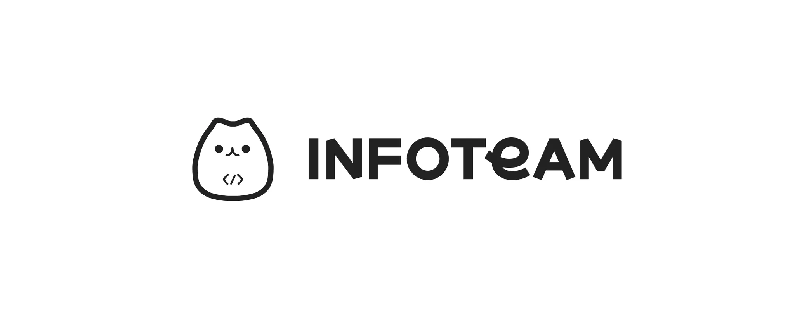
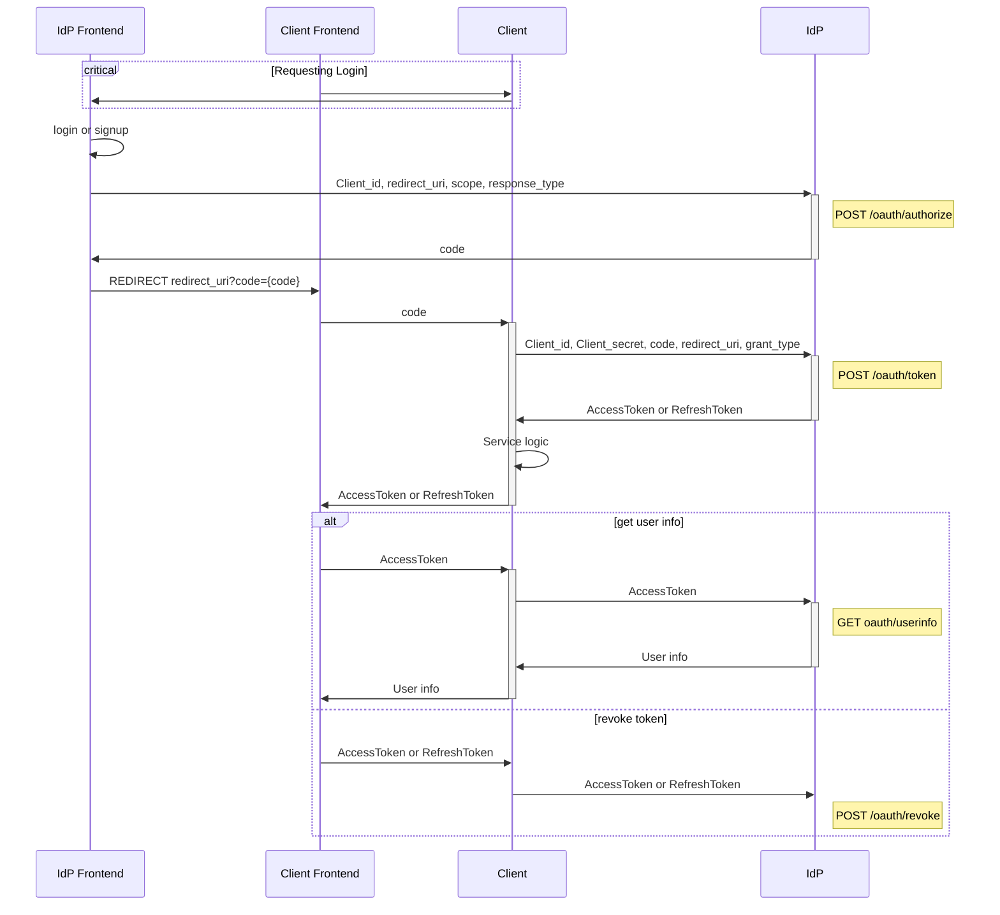

  

# Infoteam IdP

## Purpose

GIST 학생들의 계정을 한 곳에서 관리하여 GIST구성원들이 사용할 수 있는 여러 서비스에 쉽게 로그인을 할 수 있도록 하는 Id Provider Server를 만드는 것이 InfoTeam IdP의 목적입니다.

## Caution

본 서비스는 [GIST](https://www.gist.ac.kr/kr/main.html)구성원을 대상으로 하는 서비스이므로, gist구성원에게 기본적으로 지금되는 @gist.ac.kr 혹은 @gm.gist.ac.kr이메일이 필수적으로 있어야지 로그인이 가능합니다.

## Explanation

### Oauth2.1

본 서비스는 Oauth2.1 프로토콜을 이용해서 구현을 하였습니다. 따라서 본 서비스 로직의 더 자세한 정보를 알고 싶다면, 해당 문서를 참고하시기 바랍니다.  
[DOCS](https://www.ietf.org/archive/id/draft-ietf-oauth-v2-1-12.html)

### 명칭 정리

본 서비스를 사용하는 주체는 크게 두 가지가 있습니다. 하나는 user, 다른 하나는 client입니다.  
  
user는 infoteam-idp에서 gist mail을 인증하고, 관련된 정보를 제공하여 infoteam-idp를 사용하는 다른 서비스를 사용하려는 사람입니다.  
  
client는 infoteam-idp를 사용하여, user의 정보를 받고, 그에 맞추어서 서비스를 제공하는 어플리케이션입니다.

### 로그인 과정

## API DOCS

API DOCS는 swagger로 구현되어있으며, 각 문서는 아래의 페이지에서 확인할 수 있습니다.

Production: <https://api.idp.gistory.me/api>  
Staging: <https://api.stg.idp.gistory.me/api>

## Database Structure

Database structure는 dbdocs로 구현되었으며, 문서는 아래의 링크에서 확인할 수 있습니다.

<https://dbdocs.io/INFOTEAM%20GIST/idp>
