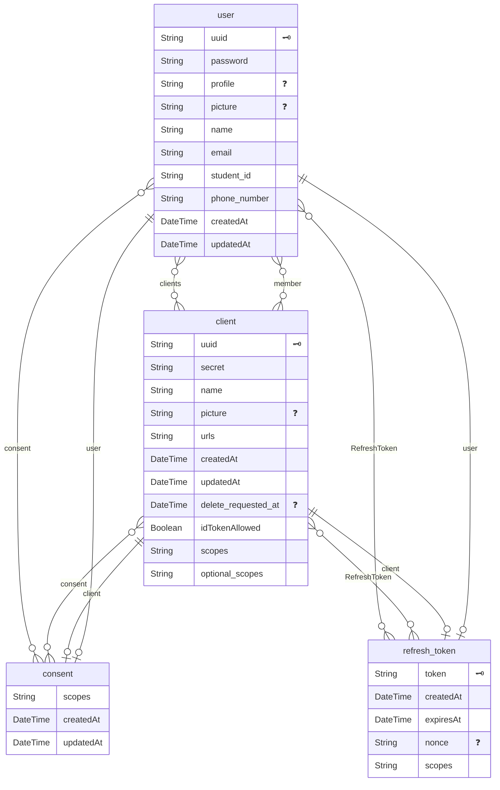

```mermaid
erDiagram

  "user" {
    String uuid "🗝️"
    String password 
    String profile "❓"
    String picture "❓"
    String name 
    String email 
    String student_id 
    String phone_number 
    DateTime createdAt 
    DateTime updatedAt 
    }
  

  "client" {
    String uuid "🗝️"
    String secret 
    String name 
    String picture "❓"
    String urls 
    DateTime createdAt 
    DateTime updatedAt 
    DateTime delete_requested_at "❓"
    Boolean idTokenAllowed 
    String scopes 
    String optional_scopes 
    }
  

  "refresh_token" {
    String token "🗝️"
    DateTime createdAt 
    DateTime expiresAt 
    String nonce "❓"
    String scopes 
    }
  

  "consent" {
    String scopes 
    DateTime createdAt 
    DateTime updatedAt 
    }
  
    "user" o{--}o "client" : "clients"
    "user" o{--}o "consent" : "consent"
    "user" o{--}o "refresh_token" : "RefreshToken"
    "client" o{--}o "user" : "member"
    "client" o{--}o "consent" : "consent"
    "client" o{--}o "refresh_token" : "RefreshToken"
    "refresh_token" o|--|| "client" : "client"
    "refresh_token" o|--|| "user" : "user"
    "consent" o|--|| "client" : "client"
    "consent" o|--|| "user" : "user"
```
