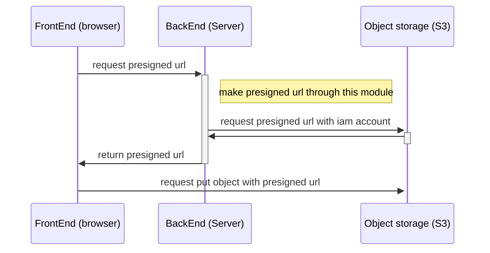

# Object Module

Object storage를 사용하기 위해서 만들어진 module입니다.  
현재는 aws의 object storage인 S3를 사용합니다.

## Flow

api서버에서 파일을 전부 처리하는 것은 서버에 부담을 줄 수 있으므로, presigned url을 사용합니다.  
presigned url을 사용하는 과정은 아래와 같습니다.



## Environment

해당 module에서 필요한 환경변수는 아래와 같습니다.  
모두 s3의 위치와 s3를 위한 iam계정의 정보에 관한 정보입니다.

``` environment
AWS_S3_REGION=ap-northeast-2
AWS_ACCESS_KEY_ID=id
AWS_SECRET_ACCESS_KEY=secret
AWS_S3_BUCKET=bucket
```
