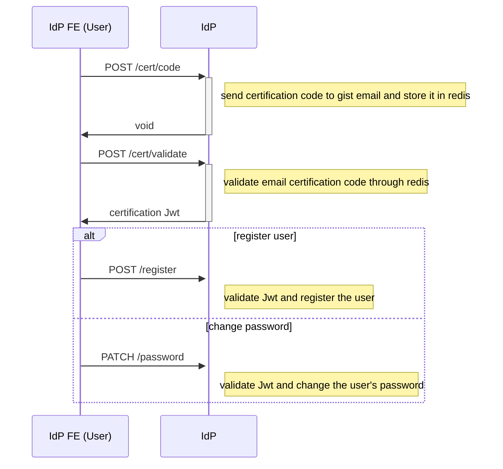

# User Module

user의 생성과 삭제를 담당하는 module입니다.  
이 module은 오직 user만 관여되어 있으며, client의 개입은 전혀 없습니다.

## Flow

user를 삭제하는 api를 제외한 다른 api들은 user의 email이 gist의 메일이 맞는지, 또한 user가 해당 메일의 주인이 맞는지 확인하는 과정을 거치므로 여러 단계를 거치게 됩니다.



## Environment

해당 module에서 필요한 환경변수는 아래와 같습니다.

``` environment
CERTIFICATION_JWT_SECRET=example-secret
CERTIFICATION_JWT_EXPIRE=3600
```
